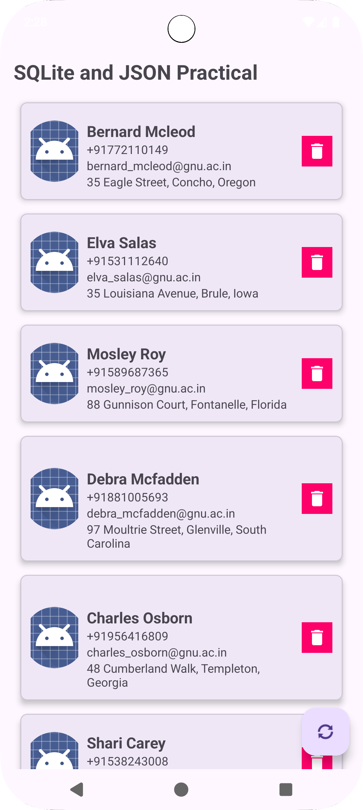

# Practical 7 - Android Person Management App

## Overview
This Android application demonstrates the implementation of a person management system with features including:
- Fetching data from a remote JSON API
- Local database storage using SQLite
- RecyclerView for displaying person data
- Refresh functionality with floating action button

## Features
- **Data Fetching**: Retrieves person data from a remote API endpoint
- **Local Storage**: Stores person information in SQLite database
- **Data Display**: Shows person list in a scrollable RecyclerView
- **Refresh Data**: Pull latest data from API with floating action button
- **Delete Function**: Remove person entries from the list

## Screenshots


## Technical Details

### Architecture
- **Language**: Kotlin
- **Database**: SQLite with custom DatabaseHelper
- **UI Components**: RecyclerView, FloatingActionButton
- **Networking**: Custom HttpRequest class for API calls
- **Concurrency**: Kotlin Coroutines for background operations

### Data Model
The app uses a `Person` data class with the following properties:
- ID (String)
- Name (String)
- Email ID (String)
- Phone Number (String)
- Address (String)

### Key Components
1. **MainActivity**: Main activity handling UI and data operations
2. **PersonAdapter**: RecyclerView adapter for displaying person data
3. **DatabaseHelper**: SQLite database management
4. **Person**: Data class representing person entity
5. **HttpRequest**: Utility class for making HTTP requests
6. **PersonDbTableData**: Database table schema and operations

## Setup Instructions

### Prerequisites
- Android Studio
- Android SDK (API level as specified in build.gradle)
- Internet permission for API calls

### Installation
1. Clone or download the project
2. Open in Android Studio
3. Sync Gradle files
4. Run on an Android device or emulator

### Permissions
The app requires the following permission:
```xml
<uses-permission android:name="android.permission.INTERNET" />
```

## API Integration
The app connects to a JSON generator API to fetch person data:
- **Endpoint**: `https://api.json-generator.com/templates/x1QbX-JkAS57/data`
- **Authentication**: Uses bearer token for API access
- **Data Format**: JSON array of person objects

## Usage
1. Launch the app to see locally stored person data
2. Tap the refresh button (FloatingActionButton) to fetch latest data from API
3. Data will be automatically saved to local database
4. Scroll through the list to view all persons
5. Use delete functionality to remove entries as needed

## Development Notes
- Uses coroutines for asynchronous operations
- Implements proper error handling for network requests
- Follows Android development best practices
- Uses Material Design components

## Package Structure
```
com.example.mad_24172012068_practical7/
├── MainActivity.kt
├── Person.kt
├── PersonAdapter.kt
├── DatabaseHelper.kt
├── PersonDbTableData.kt
└── HttpRequest.kt
```

## Build Configuration
- **Application ID**: com.example.mad_24172012068_practical7
- **Target SDK**: As specified in app-level build.gradle
- **Minimum SDK**: As specified in app-level build.gradle

---
*This project is part of Mobile Application Development practical exercises.*
